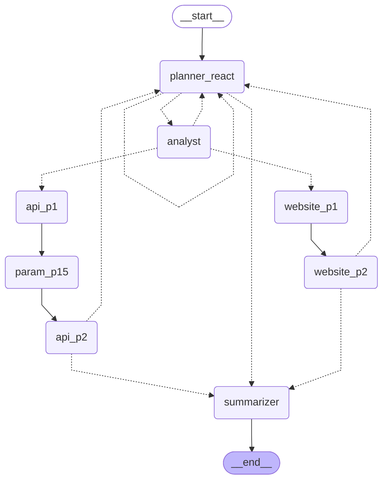

# BA Agent Flow (LangGraph → Mermaid)

This document captures the **current** Business Analyst (BA) LangGraph execution flow as a Mermaid diagram, generated directly from the compiled LangGraph.

**Source of truth**
- Graph definition: `agentic_scraper/business_analyst/graph.py`
- Mermaid export: `create_ba_graph().get_graph().draw_mermaid()`

## Regenerate The Diagram

Run from repo root:

```bash
./.venv/bin/python - <<'PY'
from agentic_scraper.business_analyst.graph import create_ba_graph
app = create_ba_graph()
print(app.get_graph().draw_mermaid())
PY
```

## Mermaid (Auto-Generated)



## Legend / How To Read This

- `-->` = unconditional edge (`workflow.add_edge(...)`)
- `-.->` = conditional edge (`workflow.add_conditional_edges(...)`)
- `__start__` / `__end__` are LangGraph synthetic boundary nodes

## Node Responsibilities (High-Level)

- `planner_react`
  - Tool-driven exploration and URL selection (gated tools + allowed URL set).
  - Emits `state["next_action"]` as `"analyze_page" | "continue" | "stop"`.
- `analyst`
  - Extracts endpoints and Phase 0 detection (`state["detected_source_type"]`, `state["detection_confidence"]`).
  - Marks `state["last_analyzed_url"]` for downstream handlers.
- `website_p1` → `website_p2`
  - WEBSITE discovery/validation path (currently centered on file-portal style discovery).
- `api_p1` → `param_p15` → `api_p2`
  - API discovery/parameter-enrichment/validation path.
- `summarizer`
  - Produces audit outputs (`site_report.json/md`) and generator-ready artifacts (`validated_datasource_spec.json`, `endpoint_inventory.json`, `executive_data_summary.md`).

## Observability / LangSmith Tracing

The BA agent supports full LangSmith tracing for observability, debugging, and run analysis. Tracing is automatically enabled when an API key is present.

### Quick Start

Set environment variables before running:

```bash
export LANGSMITH_API_KEY="lsv2_pt_..."
export LANGSMITH_PROJECT="ba-analyst"

# Run analysis with tracing
agentic-scraper analyze https://api.example.com/docs
```

### Environment Variables

**Required** (for tracing to work):
```bash
LANGSMITH_API_KEY=lsv2_pt_...
# or
LANGCHAIN_API_KEY=lsv2_pt_...
```

**Optional**:
```bash
# Project name (default: "ba-analyst")
LANGSMITH_PROJECT=my-project

# Endpoint (default: https://api.smith.langchain.com)
LANGSMITH_ENDPOINT=https://api.smith.langchain.com
```

### Disabling Tracing

**Option 1**: Don't set API key
- If no `LANGSMITH_API_KEY` or `LANGCHAIN_API_KEY` is set, tracing is automatically disabled

**Option 2**: For tests (in conftest.py)
```python
from agentic_scraper.business_analyst.tracing import disable_tracing_for_tests
disable_tracing_for_tests()
```

### What You'll See in LangSmith

When tracing is enabled, each run includes:

- **Run name**: `BA Analyze: <hostname>` (e.g., "BA Analyze: api.example.com")
- **Thread ID**: Sanitized identifier (hash-based)
- **Tags**: `component=ba`, `subsystem=langgraph`, `provider=bedrock`
- **Metadata**:
  - `seed_url` (full URL with query params)
  - `hostname`
  - `max_depth`, `max_steps`, `recursion_limit`
  - `render_mode`
  - `model_fast`, `model_reasoning`, `model_vision`
  - `package_version` (if available)

Child runs for:
- Planner agent invocations (`Planner: <hostname>`)
- Tool calls (`render_page_with_js`, `http_get_headers`, `extract_links`)
- LLM calls (via Bedrock)

### Version Compatibility

The tracing module bridges both LangSmith-style and LangChain-style environment variables to ensure compatibility across different library versions. Both sets of env vars are synchronized automatically.

